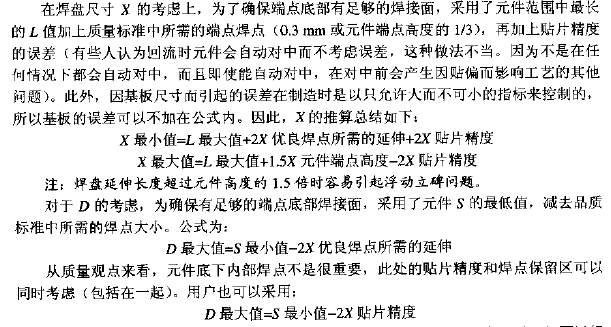

### 工艺

- PCB过孔 10/20 mil 或 8/18 mil]
- 导线间距离最好超过0.5mm(0.2 in) 最好超过8mil（0.2mm）
- 内层导线焊盘应距离板子边缘2mm以上
- 非过孔最小焊盘尺寸 D-d 1.0 mm 一般大20mil (0.5mm)
- 过孔最小焊盘尺寸 D-d 0.5 mm 通孔焊盘>31.5mil, 最小25mil, 打孔孔径12
- 字符线宽>8mil 设计字符不能上焊盘
- PCB XY均要流出3.5mm传送边
- 同类元器件尽量相同方向摆放
- 焊盘间最小距离1mm
- 导线连接到焊盘最大宽度0.4mm，或维焊盘宽度一半
- 
- 基准点尺寸 1-3 mm
- 基准点边距 不小于 4.75 mm
- 同类封装元件的距离相等
- 所有元件编号印刷方位相同
- 信号线 0.2-0.3 mm， 最细 0.05-0.07
- 电源线1.2-2.5mm
- 地线更粗
- 标准元器件两引脚间距离0.1in， 网格系统应为0.1或小于0.1的整数倍
- 焊盘内孔边缘到印制板边距离大于1mm
- 与焊盘连接的走线较细时，要设计泪滴
- 在高频时应使用穿心电容或支座电容
- 在纹波很大的电路中应使用固体电容器
- 最好电源能为各单元单独供电，使用公共电源的所有电路彼此靠近
- 交直流干线上使用电源滤波器
- 对所有电路功能状态电源应保持低输出阻抗
- 使用RC网络或二极管抑制开关瞬变
- 放大器布局应为最短距离传输低电平信号
- 多级放大器各级去耦
- 时钟频率能低就低
- 数电输出不要靠近时钟和振荡器线，也不要靠近复位线和中断线
- 每个印制板电源入口转LCL型T型滤波器
- 光电耦合器隔离
- 使用差分放大器
- 串接共模扼流圈
- 低电子信号通道不要靠近高电平信号通道
- 低电平模拟数字电路分开j
- 当有继电器等开关型元件时，应使用RC电路放电(RC穿联后与开关并联)，RC取1~2千欧，C取2.2~47nF。