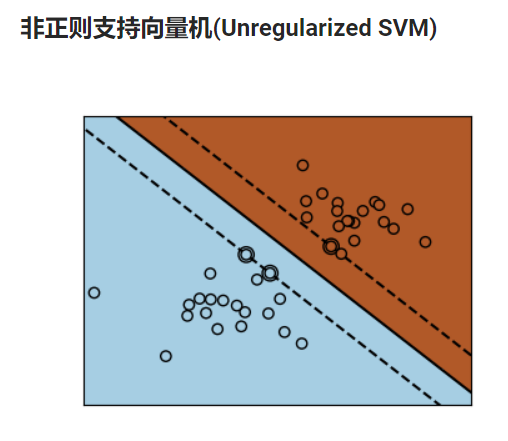
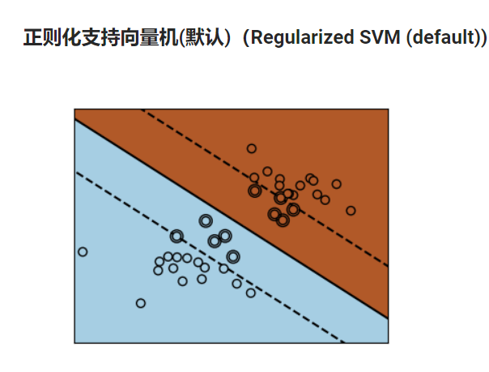

### Load Datasets

```python
from sklearn import datasets
digits = datasets.load_digits()
digits.data # load the features of the dataset
digits.target # load the label of the dataset
digits.images # show the features as 2-D array
```

### Persist The Model

```python
from sklearn import svm
from sklearn import datasets
clf = svm.SVC()
X, y = datasets.load_iris(teturn_X_y=True)
clf.fit(X, y)

import pickle
s = pickle.dumps(clf) # save the model
clf2 = pickle.loads(s) # load the model
clf2.predict(X[0:1])

from joblib import dump, load
dump(clf, 'filename.joblib') # save the model
clf.load('filename.joblib') # load the model
```

### Cast Problem

- The type of the data will be cast to float64 in default cases.

### Retraining The Model and update Parameters

```python
clf = SVC()
clf.set_params(kernel='linear').fit(X, y)
clf.set_params(kernel='rbf')
```

### Estimator

```python
estimator.fit(data)

estimarot = Estimator(param1 = 1, param2 = 2)
estimator.param1

estimator.estimated_param_
```

### Supervised Learning

```python
# Classfication and Regression
# In sk-learn, the label of classfication should be int or string vector

iris_X, iris_y = datasets.load_iris(return_X_y=True) # The first way
iris = datasets.load_iris() # The second way
features = iris.data
labels = iris.target
```

### KNN Model

```python
np.random.seed(0)
indices = np.random.permutation(len(iris_X)) # Get a random sequence of the dataset
# Create train set and test set, make the last 10 element in indices be the test data.
iris_X_train = iris_X[indices[:-10]]
iris_y_train = iris_y[indices[:-10]]
iris_X_test = iris_X[indices[-10:]]
iris_y_test = iris_y[indices[-10:]]
# Create KNN classifier
from sklearn.neighbors import KNeighborsClassifier
knn = KNeighborsClassifier()
knn.fit(iris_X_train, iris_y_train)
knn.predict(iris_X_test)
iris_y_test
```

### Linear Model

```python
from sklearn import linear_model
regr = linear_model.LinearRegression()
regr.fit(diabetes_X_train, diabetes_y_train)
print(regr.coef_) # Print the property of the model
regr.score(diabetes_X_test, diabetes_y_test) # Evaluate the model
```

### Ridge Regression

```python
from sklearn import linear_model
# This is L2 regularization
regr = linear_model.Ridge(alpha=.1)
regr.fit(diabetes_X_train, diabetes_y_train)

# Scan alpha to gain the best super parameter
alphas = np.logspace(-4, -1, 6)
print([regr.set_params(alpha=alpha)
       .fit(diabetes_X_train, diabetes_y_train)
       .score(diabetes_X_test, diabetes_y_test)
for alpha in alphas])

# This is L1 regularization(LASSO)
regr = linear_model.Lasso()
```

### Logistic Regression

```python
log = linear_model.LogisticRegression(C=1e5)
log.fit(iris_X_train, iris_y_train)
# The amount of regularization in the C parameter control logical regression object: the degree of regularization is reduced due to the larger C value.Penalty = "l2" provides the shrinkage rate (that is, the non-sparse coefficient), while penalty = "l1" provides the sparsity rate.
```

### SVM





```python
from sklearn import svm
svc = svm.SVC(kernel='linear') # SVC is support vector classification, SVR is support vector regression.
svc.fit(iris_X_train, iris_y_train)
```

### Kernel

```python
svc = svm.SVC(kernel='linear') # linear kernel
svc = svm.SVC(kernel='poly',degree=3) # polynomial kernel, degree is the degree of polynormial
svc = svm.SVC(kernel='rbf') # RBF kernel
```


### Databases

```python
iris # 鸢尾花数据集
digits # 手写数字数集
diabetes # 糖尿病数据集
```

